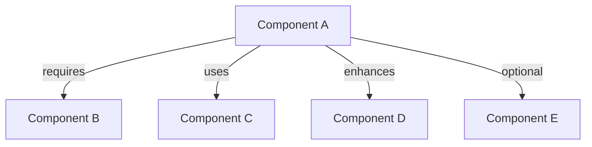

# Dependency Documentation Guide

## 1. Dependency Graph Structure

### 1.1 Graph Components


### 1.2 Required Elements
- Core System Components
  - Main framework/platform
  - Data storage
  - Authentication system
  - Caching system
  
- Feature Components
  - Core features
  - Sub-features
  - Feature relationships
  
- External Dependencies
  - Third-party services
  - Required packages
  - System dependencies

### 1.3 Relationship Types


## 2. Project Plan Structure

### 2.1 Sprint Section Template
```markdown
## Sprint [Number]: [Focus Area]

### Required Dependencies
- [ ] Category
  - [ ] Component Name
  - [ ] Dependencies
  - [ ] Tools

### Features
*Reference Feature: [Feature Name]*
- [ ] Feature Component
  - [ ] Implementation tasks
  - [ ] Dependencies
  - [ ] Integration points

### Test Cases
- [ ] Test Category
  - [ ] Test scenarios
  - [ ] Coverage requirements
```

### 2.2 Required Sections Per Sprint
1. System Dependencies
   - Core components
   - Development tools
   - Testing tools
   - Infrastructure components

2. Feature Implementation
   - Feature reference
   - Implementation tasks
   - Integration requirements
   - Component dependencies

3. Testing Requirements
   - Unit testing
   - Integration testing
   - End-to-end testing
   - Coverage requirements

## 3. Build Order Documentation

### 3.1 Implementation Steps
```markdown
# Implementation Order

## Phase 1: Core Setup
- [ ] Step 1
  - Dependencies: []
  - Components: []
  - Features: []

## Phase 2: Main Features
...
```

### 3.2 Required Elements
1. Phase Information
   - Phase number
   - Focus area
   - Time estimation
   - Resource needs

2. Dependencies
   - Previous phases
   - External systems
   - Core requirements
   - Component dependencies

3. Implementation Details
   - Feature references
   - Technical needs
   - Integration points
   - Testing criteria

## 4. Verification Checklist

### 4.1 Documentation Completeness
- [ ] All features documented
- [ ] Complete dependency graph
- [ ] System requirements listed
- [ ] Build order specified
- [ ] Test coverage defined

### 4.2 Dependency Verification
- [ ] All dependencies are bidirectional
- [ ] No circular dependencies
- [ ] Compatibility verified
- [ ] Integration points identified

### 4.3 Implementation Validation
- [ ] Build order is logical
- [ ] Dependencies are satisfied
- [ ] Testing requirements met
- [ ] Documentation complete

## Notes for Implementation

1. Dependency Graph Tips:
   - Start with core system components
   - Add features in order of dependency
   - Include all external integrations
   - Mark optional dependencies clearly

2. Project Plan Tips:
   - Break sprints by logical components
   - Group related features together
   - Define clear integration points
   - Include testing at each stage

3. Build Order Tips:
   - Start with core infrastructure
   - Build features in dependency order
   - Plan for integration testing
   - Include deployment considerations

4. Verification Tips:
   - Review dependencies regularly
   - Test integration points early
   - Validate build order feasibility
   - Document assumptions clearly