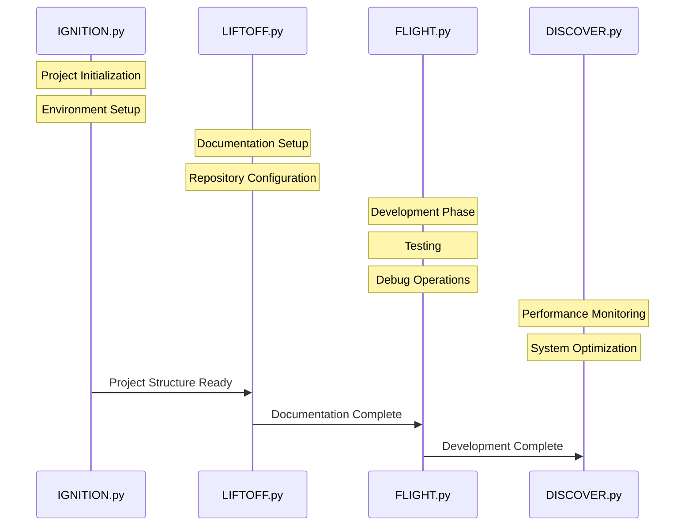

# Django Galaxy-Class Protocol

This sequence diagram illustrates the complete flow of setting up a Django project using the LIFTOFF system.

## Stage Details

## Mission Control Sequence

1. **IGNITION.py** - Project initialization and environment setup
2. **LIFTOFF.py** - Documentation and repository setup
3. **FLIGHT.py** - Development, testing and debugging phase
4. **DISCOVER.py** - Monitoring and optimization

## Stage Details

### 1. IGNITION.py - Project Initialization
- **Primary Functions:**
  - Project structure creation
  - Environment configuration
  - Initial setup validation
  - Documentation document creation
- **Output:** Ready project foundation

### 2. LIFTOFF.py - Documentation Setup
- **Primary Functions:**
  - Documentation generation
  - Repository configuration
  - Initial documentation validation
- **Output:** 
  - Complete project documentation
  - Project plan and sequence

### 3. FLIGHT.py - Development Phase
- **Primary Functions:**
  - Development workflow setup
  - Testing framework implementation
  - Code quality checks
- **Output:** Development environment ready

### 4. LANDING.py - Testing & Debugging
- **Primary Functions:**
  - Test suite execution
  - Debug tooling setup
  - Issue tracking integration
- **Output:** Validated codebase

### 5. DISCOVER.py - System Analysis
- **Primary Functions:**
  - Performance monitoring setup
  - System optimization tools
  - Analytics integration
- **Output:** Optimized system

## Success Criteria
1. Project structure initialized
2. Documentation completed
3. Development environment ready
4. Tests passing
5. Monitoring active

## Error Handling
- Project initialization failures
- Documentation generation issues
- Development environment problems
- Test failures
- Monitoring setup errors
