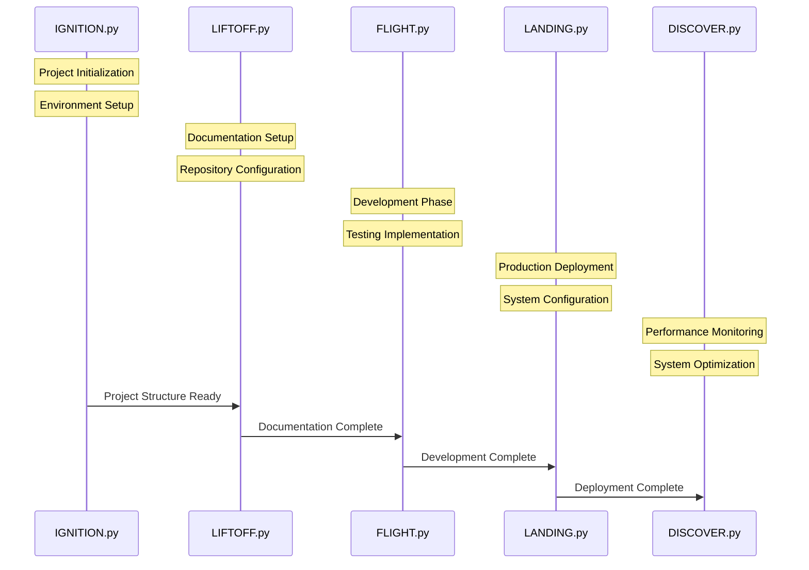

n# Django Galaxy-Class Protocol

This sequence diagram illustrates the complete flow of setting up a Django project using the LIFTOFF system.



## Stage Details

## Mission Control Sequence

1. **IGNITION.py** - Project initialization and environment setup
2. **LIFTOFF.py** - Documentation and repository setup
3. **FLIGHT.py** - Development and testing phase
4. **LANDING.py** - Deployment and production setup
5. **DISCOVER.py** - Monitoring and optimization

## Stage Details

### 1. IGNITION.py Execution
- **Input Required:** Project name
- **Primary Functions:**
  - create_virtual_environment()
  - install_required_packages()
  - setup_django_project()
  - install_dependencies()
- **Output:** Complete Django project structure

### 2. Virtual Environment Setup
- **Location:** ./venv/
- **Purpose:** Isolated Python environment
- **Key Components:**
  - Python interpreter
  - pip
  - Basic dependencies

### 3. Django Project Creation
- **Structure Created:**
  ```
  project_name/
  ├── manage.py
  ├── project_name/
  │   ├── __init__.py
  │   ├── settings.py
  │   ├── urls.py
  │   └── wsgi.py
  ```
- **Configuration:** Basic settings.py setup

### 4. LIFTOFF.py Documentation
- **Primary Functions:**
  - Mission documentation
  - Git repository setup
  - Initial commit creation
- **Documentation Generated:**
  - MISSION.md
  - Project structure documentation
  - Setup guides

### 5. Git Repository
- **Setup Steps:**
  - Repository initialization
  - Initial commit
  - Remote repository configuration (if specified)
- **Tracked Files:**
  - Django project files
  - Documentation
  - Configuration files

## Success Criteria
1. Virtual environment active and configured
2. Django project structure complete
3. All dependencies installed
4. Documentation generated
5. Git repository initialized
6. Initial commit created

## Error Handling
- Virtual environment creation failures
- Django installation issues
- Dependency conflicts
- Git configuration problems
