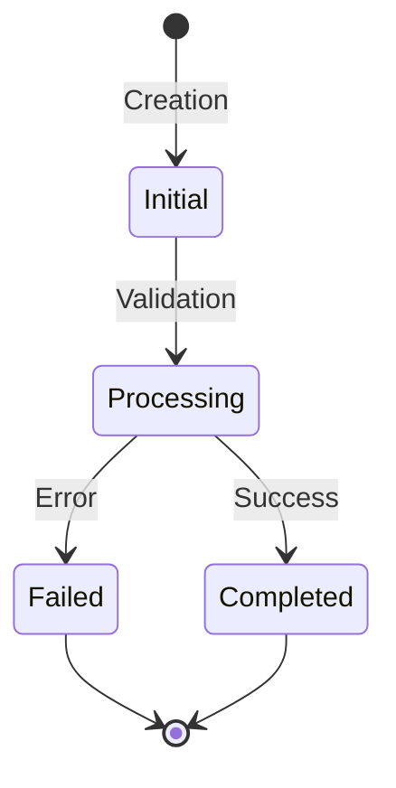

# State Diagram Documentation Guide

## Mermaid State Diagram
The state diagram should be represented using Mermaid syntax for clarity and version control compatibility.

## State Descriptions

Each state in the system should be clearly documented with the following attributes:

### Initial
- Purpose: Entry point for new objects in the system
- Validation Rules: Basic data presence and format checks
- Allowed Duration: Maximum 24 hours
- Data Requirements: Must contain all required fields

### Processing
- Purpose: Active processing state for business logic
- Validation Rules: Business rule compliance
- Allowed Duration: Configurable per business process
- Data Requirements: Valid initial state data plus processing metadata

### Completed
- Purpose: Successful terminal state
- Validation Rules: All business rules satisfied
- Data Requirements: Full audit trail and completion metadata

### Failed
- Purpose: Error terminal state
- Validation Rules: Error documentation requirements
- Data Requirements: Error codes, messages, and recovery path

## Transition Triggers

### Initial → Processing
- User Actions:
  - Submit for processing
  - Approve initial data
- System Actions:
  - Automatic validation completion
  - Scheduled processing start

### Processing → Completed
- System Actions:
  - All business rules satisfied
  - Processing steps completed
  - Final validation passed

### Processing → Failed
- System Actions:
  - Business rule violations
  - System errors
  - Timeout conditions
- User Actions:
  - Manual cancellation
  - Rejection

## Business Rules

### State Transition Rules
1. No skipping states: Objects must progress through defined transitions
2. No backward transitions: Once a terminal state is reached, no further transitions
3. Timeout handling: States must implement maximum duration rules

### Data Validation Rules
1. Each state requires specific data attributes
2. Data must be validated before state transitions
3. Error states must capture failure details

### Audit Requirements
1. All state transitions must be logged
2. State change reasons must be documented
3. Transition timestamps must be recorded
